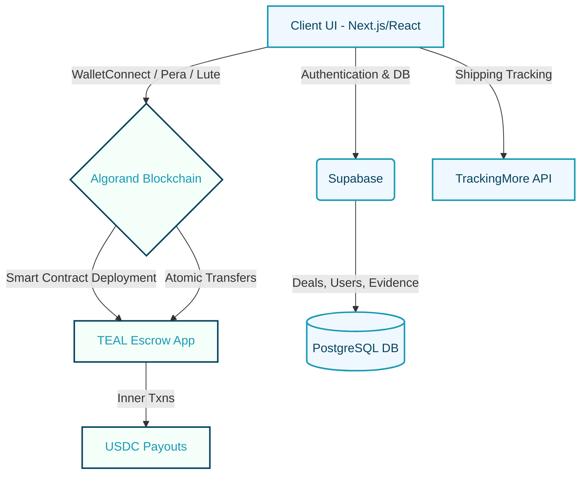
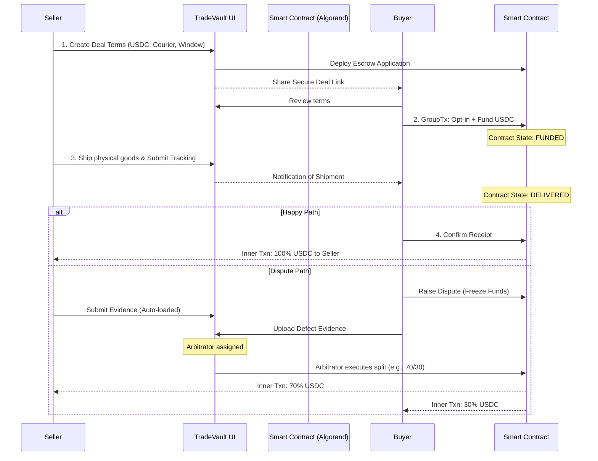

<div align="center">
  
  <h1>TradeVault</h1>
  <p><strong>From proposal to payment in 4 steps — Secure, Trustless, On-Chain Escrow.</strong></p>
</div>

<br />

## 📖 Table of Contents
- [The Problem](#the-problem)
- [Our Solution](#our-solution)
- [Why TradeVault? (Uniqueness)](#why-tradevault-uniqueness)
- [Technical Architecture](#technical-architecture)
- [File Structure (Clean Architecture)](#file-structure-clean-architecture)
- [User Workflow](#user-workflow)
- [Logistics & Tracking Transparency](#logistics--tracking-transparency)
- [Blockchain Integration](#blockchain-integration)
- [Challenges & Mitigations](#challenges--mitigations)
- [Local Installation & Setup](#local-installation--setup)
- [Team & Acknowledgments](#team--acknowledgments)

---

## 🛑 The Problem <a name="the-problem"></a>
In peer-to-peer (P2P) online marketplaces and shipping contracting, **trust is the biggest bottleneck.** 
- **Buyers** are afraid of paying upfront and never receiving the promised goods or services.
- **Sellers** hesitate to ship products or deliver work without guaranteed payment. 
- Traditional escrow services charge exorbitant fees (often 5-10%), hold funds for agonizingly long periods (3-5 business days), and rely on opaque, centralized dispute resolution processes that are prone to human bias and error. 

Additionally, international transactions are plagued by high currency conversion fees and slow wire transfer speeds.

## 💡 Our Solution <a name="our-solution"></a>
**TradeVault** is a decentralized, smart-contract-powered escrow platform built on the **Algorand Blockchain**. We eliminate the need for centralized trust by cryptographically locking payments in a transparent, immutable on-chain vault until predefined conditions (like tracked delivery confirmation) are met.

If everything goes smoothly, funds are released instantly with a mere $0.002 transaction fee. If a disagreement arises, a structured, evidence-based dispute resolution process allows an independent arbitrator to fairly split the funds.

## 🌟 Why TradeVault? (Uniqueness) <a name="why-tradevault-uniqueness"></a>

Compared to existing products (like PayPal, traditional bank escrows, or central-exchange P2P platforms):

1. **True Atomic Transactions:** Unlike traditional platforms where money sits in a corporate bank account, TradeVault groups the buyer's acceptance and USDC transfer into an *Atomic Transfer* using Algorand's layer-1 capabilities. The funds are mathematically locked into a purpose-built smart contract—not held by us.
2. **Fractional Cost:** We leverage Algorand's ultra-low fee structure. Traditional escrows cost dollars or percentages; a TradeVault execution costs mere fractions of a penny.
3. **Instant Settlements:** No 3-5 day banking delays. When a buyer confirms receipt, the smart contract's inner transaction pays the seller locally within 3.3 seconds.
4. **Verifiable Delivery:** We integrate with external shipping APIs (Logistics) to verify tracking hashes on-chain, ensuring cryptographic proof that an item was actually shipped before funds can ever be contested.
5. **Decentralized Arbitration Engine:** TradeVault incorporates an internal dispute framework that allows Arbitrators to split funds proportionally based on irrefutable evidence stored and time-stamped on-chain.

---

## 🏗️ Technical Architecture <a name="technical-architecture"></a>

TradeVault utilizes a modern, serverless architecture that bridges an intuitive Web2 frontend with a robust Web3 backend.



**Tech Stack:**
* **Frontend:** Next.js 15 (React), Tailwind CSS, Framer Motion
* **Backend:** Next.js API Routes, Supabase (PostgreSQL, Auth, Storage)
* **Blockchain:** Algorand SDK (`algosdk`), `@txnlab/use-wallet-react`, PyTeal / TEAL smart contracts
* **Integrations:** TrackingMore API (Courier Integration)

---

## 📂 File Structure (Clean Architecture) <a name="file-structure-clean-architecture"></a>

Our repository strictly follows Next.js App Router conventions with a focus on separation of concerns.

```text
TradeVault/
├── src/
│   ├── app/                      # Next.js 15 App Router pages & API
│   │   ├── (auth)/               # Grouped routes for Login/Signup
│   │   ├── api/                  # Serverless route handlers (Backend)
│   │   ├── arbitrator/           # Arbitrator dashboard & views
│   │   ├── dashboard/            # User deal management portal
│   │   ├── deal/                 # Individual smart contract views
│   │   └── page.tsx              # Public landing page
│   ├── components/               # Reusable React components
│   │   ├── landing/              # Dedicated landing page sections
│   │   ├── ui/                   # High-level UI elements
│   │   └── *Client.tsx           # Client-side component logic
│   ├── lib/                      # Core business logic & integrations
│   │   ├── algorand.ts           # algodClient, indexer configs
│   │   ├── supabase/             # Client & Admin auth instances
│   │   └── tailwind-plugins.ts   # Custom CSS logic
│   └── contracts/                # TEAL / PyTeal source code
├── public/                       # Static assets (logo, icons)
├── package.json                  # Project dependencies
└── tailwind.config.ts            # Theme definitions (#189AB4, #05445E)
```

---

## 🔄 User Workflow <a name="user-workflow"></a>

The core journey involves four deterministic steps, permanently recorded.



---

## 📦 Logistics & Tracking Transparency <a name="logistics--tracking-transparency"></a>

Financial transparency is only half the battle. To guarantee that the physical world matches the on-chain data, we've built an end-to-end logistics tracking dashboard directly into the platform window: **Transparency on TOP!**

1. **Integrated Courier APIs:** When a seller ships an item, they feed the tracking number and courier directly into TradeVault. We utilize powerful external shipping APIs (like TrackingMore) to live-fetch the package's physical location.
2. **Visual Deal Dashboard:** Buyers no longer need to check their email or courier websites. The TradeVault Deal Dashboard displays a live, visual timeline of the package's status (In Transit, Out for Delivery, Delivered) right alongside the smart contract status.
3. **Cryptographic Proof of Shipment:** When a valid tracking number is submitted, we generate a SHA-256 hash of the tracking parameters and store it on the Algorand blockchain. This ensures that the seller's claim of shipment is immutable and time-stamped, providing irrefutable evidence if a dispute is ever raised.
4. **Instant Handovers:** For local, in-person deals, we bypass couriers entirely using "Instant Delivery" cryptography—allowing the buyer to scan a QR code to instantly finalize the transaction.

---

## 💻 Blockchain Integration <a name="blockchain-integration"></a>

The project heavily utilizes the JavaScript Algorand SDK to securely compile, deploy, and interact with Application Calls. Here is a simplified example of how TradeVault groups transactions securely before broadcasting:

```typescript
// Construct a secure atomic transfer for the Buyer to fund the escrow
const params = await algodClient.getTransactionParams().do();

// 1. App Call to transition state
const appCallTxn = algosdk.makeApplicationCallTxnFromObject({
  sender: buyerWallet,
  appIndex: escrowAppId,
  onComplete: algosdk.OnApplicationComplete.NoOpOC,
  appArgs: [new TextEncoder().encode('fund')],
  suggestedParams: params,
});

// 2. USDC Asset Transfer to the Smart Contract Address
const usdcTransferTxn = algosdk.makeAssetTransferTxnWithSuggestedParamsFromObject({
  sender: buyerWallet,
  receiver: escrowContractAddress,
  assetIndex: USDC_ASSET_ID,
  amount: dealAmountInMicroUSDC,
  suggestedParams: params,
});

// Group the transactions so they either all succeed or all fail
algosdk.assignGroupID([appCallTxn, usdcTransferTxn]);

// Request user signature via their wallet (Pera/Lute)
const signedTxns = await signTransactions([appCallTxn, usdcTransferTxn]);
const { txid } = await algodClient.sendRawTransaction(signedTxns).do();

// Wait for block confirmation
await algosdk.waitForConfirmation(algodClient, txid, 4);
```

---

## 🚧 Challenges & Mitigations <a name="challenges--mitigations"></a>

Building decentralized legal frameworks involves overcoming systemic barriers:

### 1. Smart Contracts are not Recognized Legally Everywhere
* **Challenge:** Code is not always recognized as "law" in traditional jurisdictions. If an on-chain arbitration occurs, one party might attempt to sue off-chain in a local court, creating legal friction.
* **Mitigation:** TradeVault requires users to sign an explicit "Terms of Use" that designates the smart contract and subsequent arbitration results as legally binding arbitration under the New York Convention (or local equivalents). We bridge the gap by combining cryptographic signatures with formatted, printable PDF legal agreements generated upon deal creation.

### 2. Lack of Awareness / Web3 Friction
* **Challenge:** Non-crypto-native users are intimidated by wallets, gas fees, and token names.
* **Mitigation:** We utilize Account Abstraction and user-friendly wallets (like Lute Wallet via email login). The UI abstracts away "MicroAlgos" and "Teal" and simply shows terms in familiar USD equivalents. Our onboarding focuses entirely on the P2P safety benefits rather than the underlying blockchain tech.

### 3. Oracles bridging "Real-World" Delivery Status
* **Challenge:** Blockchains cannot intrinsically know if a physical item was delivered.
* **Mitigation:** We utilize trusted backend oracles bridging carrier APIs (UPS, FedEx) to write tracking verification hashes to the blockchain. We also support "Instant Handover" cryptography involving QR-code scanning for in-person local deals.

---

## 🛠️ Local Installation & Setup <a name="local-installation--setup"></a>

Follow these instructions to run TradeVault locally on your machine.

### Prerequisites
- [Node.js](https://nodejs.org/) (v18 or newer)
- [Git](https://git-scm.com/)
- A free [Supabase](https://supabase.com/) account for Database & Auth
- An Algorand Testnet node or public API endpoints (e.g., AlgoNode)

### 1. Clone the repository
```bash
git clone https://github.com/your-username/tradevault.git
cd tradevault
```

### 2. Install dependencies
```bash
npm install
# or
yarn install
```

### 3. Setup Environment Variables
Create a `.env.local` file in the root directory and add the following keys. You will need to provision your Supabase project to obtain these:

```env
# Supabase Configuration
NEXT_PUBLIC_SUPABASE_URL=your_supabase_project_url
NEXT_PUBLIC_SUPABASE_ANON_KEY=your_supabase_anon_key
SUPABASE_SERVICE_ROLE_KEY=your_supabase_service_role_key

# App Environment
NEXT_PUBLIC_APP_URL=http://localhost:3000

# Tracking API (Optional for demo)
TRACKINGMORE_API_KEY=your_trackingmore_api_key
```

### 4. Run the Development Server
```bash
npm run dev
# or 
yarn dev
```
Open [http://localhost:3000](http://localhost:3000) with your browser to see the result.

---

## 🙌 Team & Acknowledgments <a name="team--acknowledgments"></a>

**Team Name:** The TradeVault Builders

We would like to extend our deepest gratitude to:
- **Algorand Foundation** for their robust documentation and developer tools.
- **Supabase** for providing a seamless Web2 backend authentication infrastructure.
- All Open Source contributors of `algosdk`, React, Next.js, and Lucide Icons.
- Our amazing collaborators and beta-testers for their relentless feedback.

Made with 🩵 by  *Team :-* **NOT SELECTED**
