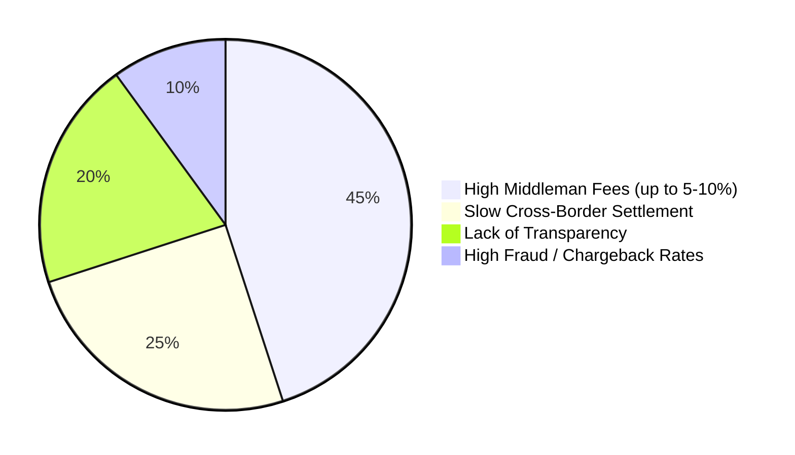
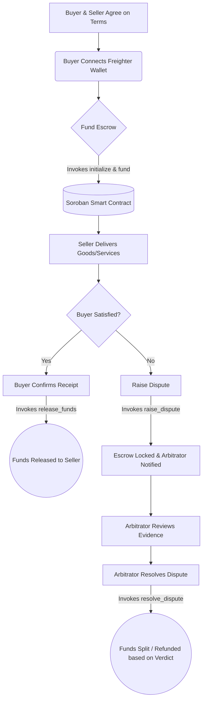
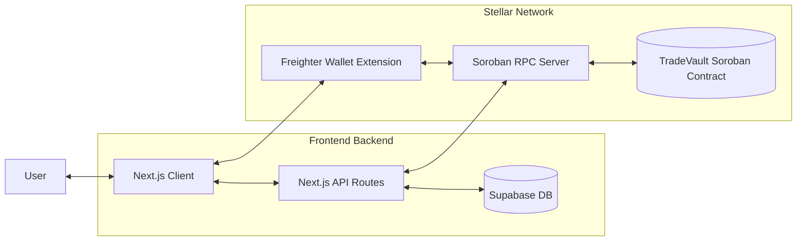

<div align="center">
  
  
  <h1>TradeVault</h1>
  <h3><strong>Secure, Trustless, and Seamless Escrow for the Decentralized Web.</strong></h3>

  <p>
    
    
    
    
    
    
    
  </p>
</div>

<br/>

## 📖 What is TradeVault?
TradeVault is a secure, trustless, decentralized escrow marketplace built on the Stellar network. It eliminates the risk of fraud in peer-to-peer online transactions by locking funds (USDC) securely inside a Soroban smart contract. Funds are only released when both parties are satisfied, or after a fair resolution by an independent platform Arbitrator.

## 🛠️ Tech Stack Overview
- **Frontend & Backend:** Next.js 16 (App Router), React 19, TypeScript
- **Styling:** Tailwind CSS, Framer Motion, Lucide Icons
- **Database & Auth:** Supabase (PostgreSQL)
- **Blockchain Interface:** `@stellar/stellar-sdk`, `@stellar/freighter-api`
- **Smart Contracts:** Rust, Soroban SDK (Compiled to `wasm32v1-none`)

---

## ✨ Features

| Feature                                                    | Status  |
| ---------------------------------------------------------- | ------- |
| Wallet connect via Freighter                               | ✅ Live |
| Trustless Wallet-to-Contract Escrow (Soroban)              | ✅ Live |
| Real-time milestone & tracking sync (Supabase)             | ✅ Live |
| Pay and lock shares with USDC via Freighter                | ✅ Live |
| Dispute resolution mechanism                               | ✅ Live |
| Transaction hash receipt linked to Stellar Explorer        | ✅ Live |
| Arbitrator dashboard & granular percentage splits          | ✅ Live |
| Immutable on-chain payment recording                       | ✅ Live |
| Mobile-responsive UI                                       | ✅ Live |

---

## 📊 Market Analysis: Traditional vs. Decentralized Escrow

**Major Inefficiencies in the Traditional Escrow Market:**


TradeVault directly addresses these pain points by utilizing Stellar's near-instant block finality and mathematically proven Soroban smart contracts, reducing middleman fees to near-zero while operating globally.

---

## 🔄 User Workflow



---

## 🏛️ Core Architecture



---

## 🚀 Deployment Status & Contract Details

The TradeVault escrow system has been fully migrated to Stellar's Soroban architecture and is currently live on the **Stellar Testnet**.

### Deployed Contract

| Field       | Value                                                                                                                                  |
| ----------- | -------------------------------------------------------------------------------------------------------------------------------------- |
| Contract ID | `CD7P7SINFDFSHLBOGEBFMAJWPZC4CULFASS4JQF22YJ3LQVNNJRWV2HP`                                                                             |
| Network     | Stellar Testnet                                                                                                                        |
| Language    | Rust                                                                                                           |
| Explorer    | [stellar.expert → contract](https://stellar.expert/explorer/testnet/contract/CD7P7SINFDFSHLBOGEBFMAJWPZC4CULFASS4JQF22YJ3LQVNNJRWV2HP) |

### Verified Contract Call Transaction

**Transaction hash:** `71fa9900c3b53f6fbacdb560a8b92b67f168fbc50fbcc4468f71295fc74f4b23` *(Example initialization)*

[View on Stellar Explorer](https://stellar.expert/explorer/testnet/tx/71fa9900c3b53f6fbacdb560a8b92b67f168fbc50fbcc4468f71295fc74f4b23)

### Contract Functions

| Function                                                              | Type  | Purpose                                                 |
| --------------------------------------------------------------------- | ----- | ------------------------------------------------------- |
| `initialize(deal_id, buyer, seller, arbitrator, token, amount)`       | Write | Sets up the initial escrow terms and participants       |
| `fund(deal_id, buyer)`                                                | Write | Pulls funds from buyer's wallet into the smart contract |
| `release_funds(deal_id, buyer)`                                       | Write | Buyer approves transferring the locked USDC to seller   |
| `raise_dispute(deal_id, caller)`                                      | Write | Either party can lock the escrow to require an admin    |
| `resolve_dispute(deal_id, arbitrator, buyer_amount, seller_amount)`   | Write | Arbitrator splits the funds between buyer and seller    |
| `get_status(deal_id)`                                                 | Read  | Checks the real-time funding and dispute status         |

**Error codes / Panics handled:**

| Condition              | Meaning                                                                    |
| ---------------------- | -------------------------------------------------------------------------- |
| `Already initialized`  | Deal state is already configured on-chain                                  |
| `Cannot fund`          | Status is not awaiting funding                                             |
| `Only buyer can fund`  | Validates that the transaction signer matches the initial configuration    |
| `Cannot release`       | Execution blocked because funds are not currently locked in the contract   |
| `Resolution mismatch`  | Split logic amounts do not sum perfectly to the total escrow lock          |

---

## 💻 How to Start the Project Locally

### Prerequisites
1. **Node.js** (v18+)
2. **Freighter Wallet Extension** installed in your browser (Set to Testnet with funded test USDC).
3. **Rust** & **Stellar CLI** (Only if you intend to recompile the Soroban contract locally).

### Installation Steps

1. **Clone the repository:**
   ```bash
   git clone <repository-url>
   cd tradevault
   ```

2. **Install dependencies:**
   ```bash
   npm install
   ```

3. **Environment Setup:**
   Ensure you have a `.env.local` file at the root of the project with the required Supabase and Stellar config variables:
   ```env
   NEXT_PUBLIC_SUPABASE_URL=your_supabase_url
   NEXT_PUBLIC_SUPABASE_ANON_KEY=your_supabase_anon_key
   STELLAR_PLATFORM_SECRET=your_trusted_backend_signer_secret
   NEXT_PUBLIC_STELLAR_NETWORK_PASSPHRASE="Test SDF Network ; September 2015"
   NEXT_PUBLIC_STELLAR_CONTRACT_ID=CD7P7SINFDFSHLBOGEBFMAJWPZC4CULFASS4JQF22YJ3LQVNNJRWV2HP
   ```

4. **Run the development server:**
   ```bash
   npm run dev
   ```

5. **Open the App:**
   Navigate to [http://localhost:3000](http://localhost:3000) in your browser.

---

## 💖 Thank You!
Thank you for checking out TradeVault! We believe decentralized technology is the future of fair and secure peer-to-peer commerce. If you have any feedback or wish to contribute, please feel free to open an issue or submit a pull request!
