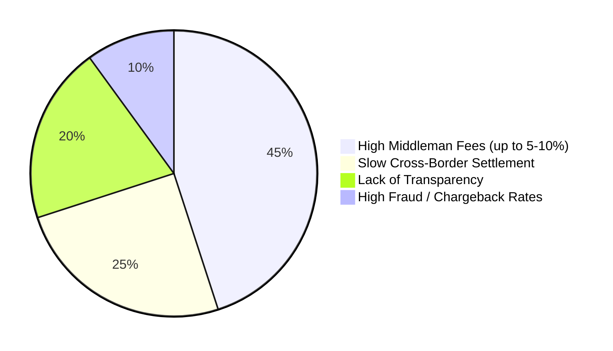
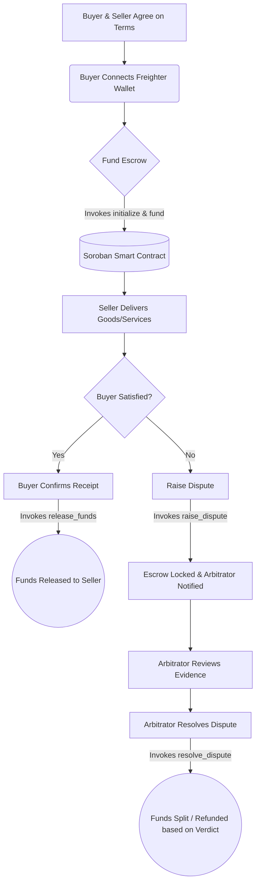
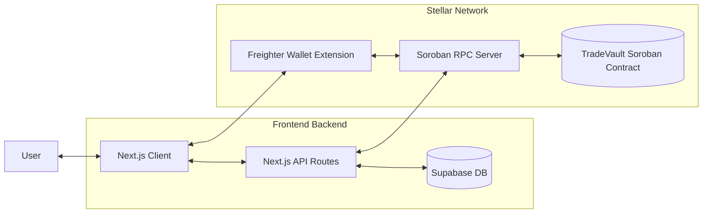

<div align="center">
  
  
  <h1>TradeVault</h1>
  <h3><strong>Secure, Trustless, and Seamless Escrow for the Decentralized Web.</strong></h3>

  <p>
    
    
    
    
    
    
    
  </p>
</div>

<br/>

## 📖 What is TradeVault?
TradeVault is a secure, trustless, decentralized escrow marketplace built on the Stellar network. It eliminates the risk of fraud in peer-to-peer online transactions by locking funds (USDC) securely inside a Soroban smart contract. Funds are only released when both parties are satisfied, or after a fair resolution by an independent platform Arbitrator.

## ⚠️ The Current Gap
In today's digital economy, transacting with unknown parties across the globe is incredibly risky. 
- **For Buyers:** Paying upfront without a guarantee of delivery often leads to scams.
- **For Sellers:** Delivering work or shipping physical goods before payment exposes them to chargebacks and non-payment.
- **Legacy Solutions:** Traditional escrow platforms (like Escrow.com) or freelance marketplaces (like Upwork/Fiverr) charge exorbitant fees (often 5% to 20%), require lengthy KYC delays, hold funds for weeks, and process slow cross-border fiat settlements. 

## 💡 What We Provide (Our USP)
TradeVault provides a **trustless, instant, and low-cost** alternative by moving the escrow process entirely on-chain using Stellar's Soroban smart contracts. 
- **Zero Middleman Risk:** We don't hold your funds. They are locked cryptographically in a smart contract.
- **Fractional Fees:** Leveraging the Stellar network, transaction fees are pennies, compared to hundreds of dollars on legacy platforms.
- **Global & Permissionless:** Anyone with a Freighter wallet can instantly lock USDC and conduct business globally without banking restrictions.
- **Fair Dispute Resolution:** If things go wrong, an impartial platform Arbitrator steps in to fairly distribute the locked funds based on evidence, preventing unilateral chargebacks.

## 🏢 Use Cases & Example Projects
TradeVault is flexible enough to handle almost any peer-to-peer transaction:
1. **Freelance Contracts:** A freelance developer in India builds a website for a client in the US. The client locks $5,000 USDC in TradeVault. The developer builds with peace of mind knowing the funds are secured. Once the site is delivered, the funds are instantly released.
2. **High-Value Digital Assets:** Buying or selling domains, social media accounts, or rare game items. TradeVault ensures the buyer has the funds and the seller delivers the asset before the swap finalizes.
3. **Physical Goods Delivery:** Purchasing a luxury watch from an international seller. The funds are locked up until the buyer confirms the tracking number shows "Delivered" and the item is authentic.
4. **Over-The-Counter (OTC) Crypto Trades:** Large buyers and sellers exchanging tokens without trusting a centralized exchange to hold custody.

## 📊 Market Analysis: Traditional vs. Decentralized Escrow

**Major Inefficiencies in the Traditional Escrow Market:**


TradeVault directly addresses these pain points by utilizing Stellar's near-instant block finality and mathematically proven Soroban smart contracts.

## 💰 Business Scope & Platform Fees
TradeVault introduces a highly scalable and sustainable revenue model while remaining an order of magnitude cheaper than centralized competitors:
- **Contract Interaction Fee:** A flat fee (e.g., ~$1-2) or a minimal percentage (e.g., 0.5% - 1%) charged upon the successful release of funds, drastically undercutting traditional 5-10% fees.
- **Arbitration Fees:** In the event of a dispute, a nominal fee is taken from the escrowed amount to compensate the Arbitrator for their time resolving the issue.
- **Premium Features:** Future scoping includes white-labeling the escrow API for other marketplaces, tiered merchant accounts, and integrations with stablecoin yield generation while funds are locked.

## 🛠️ Tech Stack Overview
- **Frontend & Backend:** Next.js 16 (App Router), React 19, TypeScript
- **Styling:** Tailwind CSS, Framer Motion, Lucide Icons
- **Database & Auth:** Supabase (PostgreSQL)
- **Blockchain Interface:** `@stellar/stellar-sdk`, `@stellar/freighter-api`
- **Smart Contracts:** Rust, Soroban SDK (Compiled to `wasm32v1-none`)

## 🌌 Why Stellar & Soroban?
TradeVault specifically utilizes the Stellar network and Soroban (Stellar's smart contract platform) for several crucial reasons:
- **Cost-Efficiency:** Escrow relies on locking and transferring value. Traditional blockchains have high gas fees that make micro-escrows impossible. Stellar’s fees are fractions of a cent.
- **Speed:** Stellar boasts near-instant block finality (3-5 seconds). Users don't have to wait minutes for a transaction to clear before shipping goods or confirming receipt.
- **First-Class Stablecoins:** Stellar treats USDC and other stable assets natively without complex token wrappers, making dollar-pegged transfers incredibly secure.
- **Performance & Safety:** Soroban allows us to write safe, highly performant, and deeply auditable smart contracts using Rust.

---

## ✨ Features

| Feature                                                    | Status  |
| ---------------------------------------------------------- | ------- |
| Wallet connect via Freighter                               | ✅ Live |
| Trustless Wallet-to-Contract Escrow (Soroban)              | ✅ Live |
| Real-time milestone & tracking sync (Supabase)             | ✅ Live |
| Pay and lock shares with USDC via Freighter                | ✅ Live |
| Dispute resolution mechanism                               | ✅ Live |
| Transaction hash receipt linked to Stellar Explorer        | ✅ Live |
| Arbitrator dashboard & granular percentage splits          | ✅ Live |
| Immutable on-chain payment recording                       | ✅ Live |
| Mobile-responsive UI                                       | ✅ Live |

---

## 🔄 User Workflow



---

## 🏛️ Core Architecture



---

## 🚀 Deployment Status & Contract Details

The TradeVault escrow system has been fully migrated to Stellar's Soroban architecture and is currently live on the **Stellar Testnet**.

### Deployed Contract

| Field       | Value                                                                                                                                  |
| ----------- | -------------------------------------------------------------------------------------------------------------------------------------- |
| Contract ID | `CBXMQHXWM3ZTZUN2CV7FLSTG6Y3M6PG7XNADM5W6S3FCJWGQ43V2IFFL`                                                                             |
| Network     | Stellar Testnet                                                                                                                        |
| Language    | Rust                                                                                                           |
| Explorer    | [stellar.expert → contract](https://stellar.expert/explorer/testnet/contract/CBXMQHXWM3ZTZUN2CV7FLSTG6Y3M6PG7XNADM5W6S3FCJWGQ43V2IFFL) |

### Verified Contract Call Transaction

**Transaction hash:** `8483229ec13c065e6727d936c3543f5be91b7bc20bf3cc731bdd42e717b75519` *(Verified testnet contract call)*

[View on Stellar Explorer](https://stellar.expert/explorer/testnet/tx/8483229ec13c065e6727d936c3543f5be91b7bc20bf3cc731bdd42e717b75519)

### Contract Functions

| Function                                                              | Type  | Purpose                                                 |
| --------------------------------------------------------------------- | ----- | ------------------------------------------------------- |
| `create_deal(seller, buyer, arbitrator, token, amount_usdc, delivery_days, dispute_days)` | Write | Creates escrow terms for a single contract instance |
| `accept_deal()`                                                       | Write | Buyer accepts a proposed deal                            |
| `fund_deal()`                                                         | Write | Transfers escrow amount from buyer to contract           |
| `submit_delivery(tracking_hash)`                                      | Write | Seller submits delivery and starts dispute window        |
| `confirm_package()`                                                   | Write | Buyer confirms receipt and releases funds to seller      |
| `raise_dispute(reason_hash)`                                          | Write | Buyer raises dispute while dispute window is active      |
| `resolve_dispute(seller_pct, buyer_pct)`                              | Write | Arbitrator splits escrow amount by percentages           |
| `timeout_release()`                                                   | Write | Releases funds to seller after dispute window closes     |
| `get_state()`                                                         | Read  | Returns current deal state enum                          |

**Error codes / Panics handled:**

| Condition              | Meaning                                                                    |
| ---------------------- | -------------------------------------------------------------------------- |
| `deal already initialized` | Contract instance was already initialized                               |
| `amount must be > 0`       | Escrow amount must be positive                                          |
| `delivery_days must be > 0`| Delivery SLA must be positive                                           |
| `dispute_days must be > 0` | Dispute window must be positive                                         |
| `invalid state transition` | Called function is not valid for current deal state                     |
| `dispute window closed`    | Dispute cannot be raised after cutoff                                   |
| `dispute window still active` | Timeout release called before dispute window expires                 |
| `percentages must sum to 100` | Arbitrator split must total exactly 100%                            |

### Level 2 Completion Checklist

Current Level 2 completion status is tracked against concrete code and runtime evidence.

| Requirement | Status | Evidence |
| --- | --- | --- |
| 3+ error types handled | ✅ Complete | Contract panics + API validation + wallet/auth + network failures |
| Contract deployed on Stellar testnet | ✅ Complete | Contract: [stellar.expert contract](https://stellar.expert/explorer/testnet/contract/CBXMQHXWM3ZTZUN2CV7FLSTG6Y3M6PG7XNADM5W6S3FCJWGQ43V2IFFL) |
| Contract called from frontend | ✅ Complete | Buyer and dispute flows call deployed Soroban methods |
| Transaction status visible to users | ✅ Complete | Status persisted via API route and displayed in UI flow |
| 2+ meaningful commits | ✅ Complete | Repository history contains multiple feature/fix commits |
| Real-time approach clarified | ✅ Complete | Polling-based updates (30s in development, 2h in production) + daily timeout cron |

Level 2 tx-link proof capture (screenshots intentionally deferred):

- Happy path tx links:
    - create_deal: TODO
    - accept_deal + fund_deal: TODO
    - submit_delivery: TODO
    - confirm_package: TODO
- Dispute path tx links:
    - raise_dispute: TODO
    - resolve_dispute: TODO

Validate collected tx links in one command:

```bash
npm run level2:validate-tx -- <tx-hash-or-explorer-url> <tx-hash-or-explorer-url>
```

Or validate from a file (one hash/url per line):

```bash
npm run level2:validate-tx -- --file ./level2-tx-links.txt
```

Reference runbook: `LEVEL2_PROOF_CAPTURE_RUNBOOK.md`.

Note: Screenshot capture is intentionally deferred for now as requested.

---

## 📂 Project Structure

```text
tradevault/
├── contract/                   # Rust smart contract source code
│   ├── src/lib.rs              # Active Soroban escrow contract implementation
│   ├── Cargo.toml              # Active contract manifest
│   └── legacy/                 # Archived older contract workspace(s)
│       └── soroban_escrow/
├── src/
│   ├── app/                    # Next.js App Router UI pages and Backend API routes
│   │   ├── arbitrator/         # Arbitrator dashboard & dispute management UI
│   │   ├── deal/               # Deal creation and escrow management flows
│   │   └── api/                # Backend routes for DB sync & resolving disputes
│   ├── components/             # Reusable React components (UI, Forms, Modals)
│   │   └── ui/                 # Pre-built UI elements like buttons & cards
│   ├── lib/                    # Helper functions and core platform logic
│   │   ├── stellar.ts          # Soroban RPC and Freighter wallet integration logic
│   │   └── supabase/           # Database schema and client initialization
│   └── middleware.ts           # Next.js auth & route protection logic
├── supabase/                   # Supabase DB SQL schema, policies, and roles
├── public/                     # Static assets (including the TradeVault logo)
└── package.json                # Project dependencies and deployment scripts
```

---

## 💻 How to Start the Project Locally

### Prerequisites
1. **Node.js** (v18+)
2. **Freighter Wallet Extension** installed in your browser (Set to Testnet with funded test USDC).
3. **Rust** & **Stellar CLI** (Only if you intend to recompile the Soroban contract locally).

### Installation Steps

1. **Clone the repository:**
   ```bash
   git clone https://github.com/thisisouvik/tradevault-stellar
   cd tradevault
   ```

2. **Install dependencies:**
   ```bash
   npm install
   ```

3. **Environment Setup:**
   Ensure you have a `.env.local` file at the root of the project with the required Supabase and Stellar config variables:
   ```env
   NEXT_PUBLIC_SUPABASE_URL=your_supabase_url
   NEXT_PUBLIC_SUPABASE_ANON_KEY=your_supabase_anon_key
   STELLAR_PLATFORM_SECRET=your_trusted_backend_signer_secret
   NEXT_PUBLIC_STELLAR_NETWORK_PASSPHRASE="Test SDF Network ; September 2015"
    NEXT_PUBLIC_STELLAR_CONTRACT_ID=CBXMQHXWM3ZTZUN2CV7FLSTG6Y3M6PG7XNADM5W6S3FCJWGQ43V2IFFL
    STELLAR_CONTRACT_ID=CBXMQHXWM3ZTZUN2CV7FLSTG6Y3M6PG7XNADM5W6S3FCJWGQ43V2IFFL
   ```

4. **Run the development server:**
   ```bash
   npm run dev
   ```

5. **Run automated tests (Phase 2):**
    ```bash
    npm test
    ```

### Test Coverage (Phase 2)

Current automated tests validate core escrow lifecycle and API validation rules:

- Supported patch statuses for deal updates
- Valid and invalid escrow state transitions (e.g. `PROPOSED -> FUNDED`, `DELIVERED -> COMPLETED`)
- Stellar transaction hash format validation
- Action-to-contract-method mapping (`fund`, `confirm`, `dispute`)
- Create-deal payload validation (required fields, positive amount, positive delivery days)
- Dispute split validation (buyer/seller percentages must sum to `100`)

Latest local run status: **10 tests passing**.

Sample local output:

```text
RUN  v3.2.4 /home/soumen/stellar/tradevault-stellar
✓ tests/apiValidators.test.ts (5 tests)
✓ tests/dealLifecycle.test.ts (5 tests)
Test Files  2 passed (2)
Tests      10 passed (10)
```

### Level 3 Delivery Artifacts

Use this section to track and attach required Level 3 evidence.

| Requirement | Status | Evidence |
| --- | --- | --- |
| Automated tests (3+) | ✅ Complete | `npm test` (10 passing) |
| Happy-path flow proof | ⏳ Pending manual capture | Add tx hash + screenshots |
| Dispute-path flow proof | ⏳ Pending manual capture | Add tx hash + screenshots |
| Demo video | ⏳ Pending upload | Add video URL |

Happy-path proof links (create -> fund -> submit delivery -> confirm):
- TODO: Stellar Explorer tx link(s)
- TODO: screenshot link(s)

Dispute-path proof links (raise dispute -> resolve dispute):
- TODO: Stellar Explorer tx link(s)
- TODO: screenshot link(s)

Demo video:
- TODO: add public video URL

### Known Limitations (Current)

- Real-time updates are currently polling-based, not event-subscription based.
- End-to-end flow proof links and screenshots are not committed yet.
- Demo video URL has not been attached yet.

6. **Open the App:**
   Navigate to [http://localhost:3000](http://localhost:3000) in your browser.

---

## 💖 Thank You!
Thank you for checking out TradeVault! We believe decentralized technology is the future of fair and secure peer-to-peer commerce. If you have any feedback or wish to contribute, please feel free to open an issue or submit a pull request!
